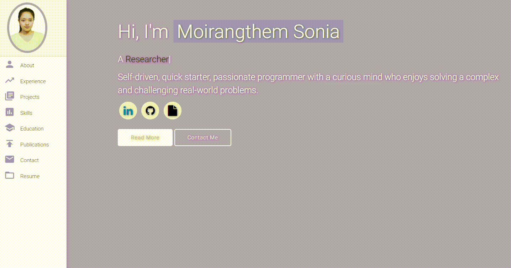

# Personal Portfolio ⚡️ 
> A clean, beautiful, responsive portfolio template !

> https://moirangthemsonia.github.io/

 

### Website Preview

 
  <kbd>
    
  </kbd>

:star: Star me on GitHub — it helps!

## Features 📋
⚡️ Fully Responsive\
⚡️ Valid HTML5 & CSS3\
⚡️ Typing animation using `Typed.js`\
⚡️ Transition Effect using `Effect.js`\
⚡️ Easy to modify

## Installation & Deployment 📦
- Clone the repository and customize the content of index.html to meet your specific requirements.
- Modify the moirangthemsonia.github.io/assets/img/ directory by adding or removing images as necessary.
- To deploy your website, please create a GitHub repository named <your-github-username>github.io, ensuring that no other name is used.
- Finally, push the generated code to the master branch of the repository.
- <b>NOTE:</b> Additionally, integrate your personal Google Tag Manager and Google Analytics IDs to track site performance and ensure proper indexing.

## Sections 📚
✔️ About me\
✔️ Experience\
✔️ Projects \
✔️ Skills \
✔️ Education\
✔️ Publications\
✔️ Contact Info\
✔️ Resume

## Tools Used 🛠️
* [<b>GitHub Pages</b>](https://create-react-app.dev/docs/deployment/#github-pages) - To host my static website (HTML, CSS, JS, jQuery).
* [<b>Materialize</b>](https://materializecss.com/) - A CSS framework to get Google's Material Design components.
* [<b>Typed.js</b>](https://mattboldt.com/demos/typed-js/) - JavaScript Library

## Contributing 💡
#### Step 1

- **Option 1**
    - 🍴 Fork this repo!

- **Option 2**
    - 👯 Clone this repo to your local machine.

#### Step 2

- **Build your code** 🔨🔨🔨

#### Step 3

- 🔃 Create a new pull request.

## Acknowledgments 👏
## Acknowledgments

I would like to express my gratitude to [Varad Bhogayata](https://github.com/varadbhogayata/varadbhogayata.github.io) for their exceptional work on this project. This repository was forked to further develop and enhance the existing ideas and contributions. Their foundational work has greatly facilitated this endeavor.

## License 📄
This project is licensed under the MIT License - see the [LICENSE.md](./LICENSE) file for details.
